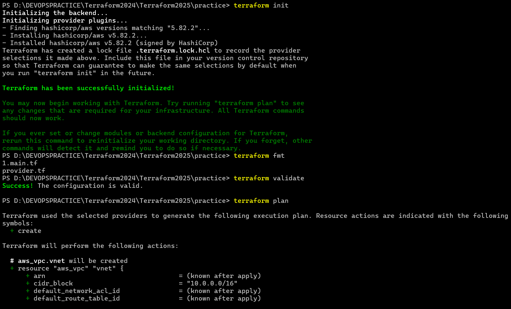

# Infra Provisioning with Terraform 

* Infra Provisioning helps in automating the infra creation, To do this we have various approaches. 
   *  __scripts (use awscli/azurecli/python)__
      *  procedural (how it has to be done)
      *  focus is on steps
   
   * __Infrastruce  as Code (IaC)__
      * Declarative (what is needed)
      * Focus is on desired state
   
* __Popular IaC Tools__ 
   
* __Cloud formation:__ 
    * This works only on AWS


* __ARM Templates__
   * This works only on Azure
   * Bicep (Azure)

* __Terraform:__
   * This works with almost all clouds and even hypervisors like vmware

* __OpenTofu:__
   * This is a fork of terraform and will remain opensource

# Terraform

 * This is a project by Hashicorp
 * Terraform is developed in Golang
 * Terraform uses a language called as HCL (Hashicorp Configuration Language)

# Terraform components

* Template
* Providers 
 


* Resources


* __Terminology:__
 
 * Arguments: Refers to an input
 * Attribute: Refers to an output 

* __Installing Terraform__

* refer: https://developer.hashicorp.com/terraform/install
* configure aws to your terminal 


* Hello terraform
   * Create a new folder
   * Create a new file called as main.tf in it
   
```
# aws vpc 

resource "aws_vpc" "vnet" {
  cidr_block = "10.0.0.0/16"
  tags = {
    Name = "vnet"
  }

}

#  provider 

terraform {
  required_providers {
    aws = {
      source  = "hashicorp/aws"
      version = "5.82.2"
    }
  }
}

provider "aws" {
  region = "ap-south-1"
}
```

* Now from your terminal cd into this folder and execute
```
   terraform init
   terraform fmt
   terraform validate
   terraform plan
   terraform apply
```


 
We can connect to multiple clouds from same template.

