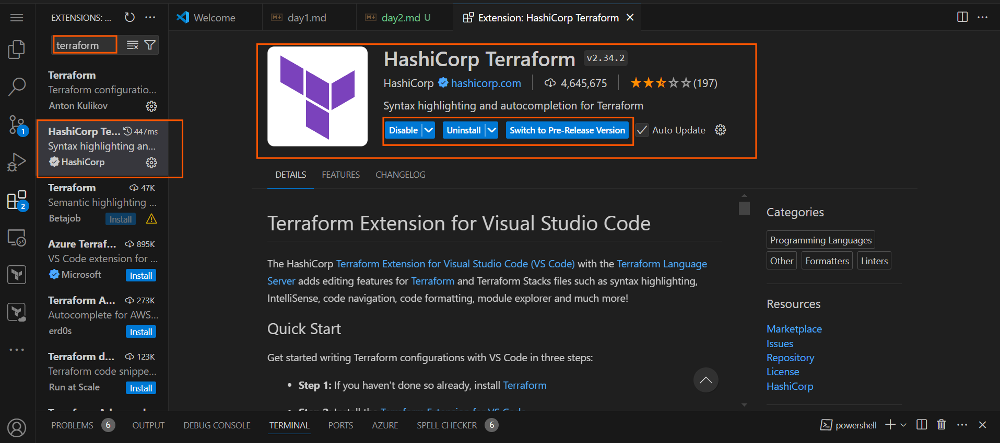
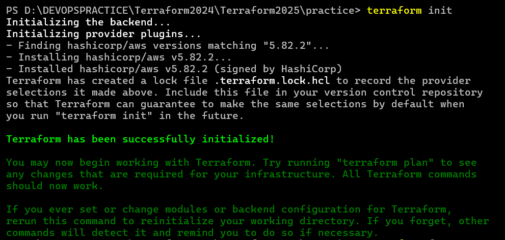
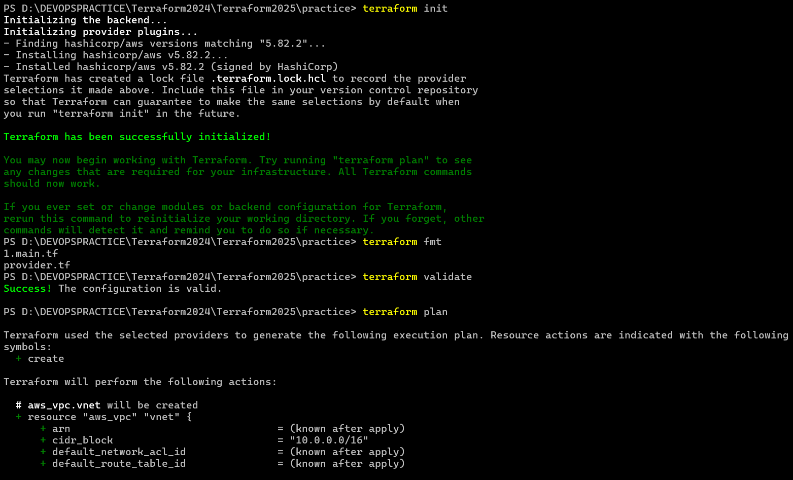
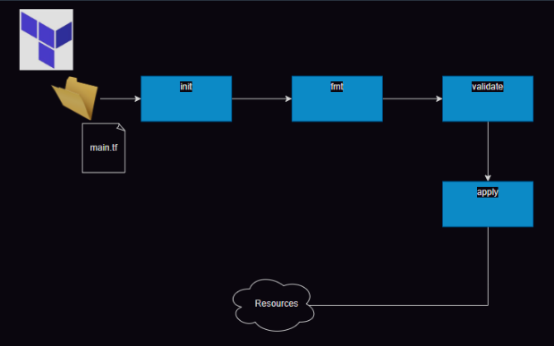

# Setting up VS Code for terraform

* We need to install an extension for  Terraform from hashicorp


# Creating the required infra with Terraform

* Activity 1: I want to create a vpc with 4 subnets in AWS

* AWS Credentials: Ensure you have aws cli installed and configured 

* Data types in Terraform
  * refer: https://developer.hashicorp.com/terraform/language/expressions/types
 
 * __string:__ a sequence of Unicode characters representing some text, like "hello".
 
 * __number:__ a numeric value. The number type can represent both whole numbers like 15 and fractional values like 6.283185.
 
 * __bool:__ a boolean value, either true or false. bool values can be used in conditional logic.
 
 * __list (or tuple):__ a sequence of values, like ["us-west-1a", "us-west-1c"]. Identify elements in a list with consecutive whole numbers, starting with zero. 
 
 * __set:__ a collection of unique values that do not have any secondary identifiers or ordering.
 
 * __map or object:__ a group of values identified by named labels, like {name = "Mabel", age = 52}.

# Hashicorp Configuration Language (HCL)

* refer: https://developer.hashicorp.com/terraform/language/syntax/configuration

# Terraform AWS Provider
  * refer: https://registry.terraform.io/providers/hashicorp/aws/latest/docs

```
terraform {
    required_providers {
        aws = {
            source = "hashicorp/aws"
            version = "5.82.2"
        }
    }

}
```
* Lets try to configure the provider

```
provider "<name>" {
    arg1 = value1
    ...
    ..
    argn = valuen

}
```

* AWS Provider Argument reference: 
  * refer:  

* As of now our main.tf looks as shown below

```
terraform {
    required_providers {
      aws = {
        source = "hashicorp/aws"
        version = "5.82.2"
      }
    }
}

provider "aws" {
    region = "ap-south-1"
}
```
* Now from terminal
* download providers and initialize terraform init


* Format the template terraform fmt
* Validate the template terraform validate


# Resource block in terraform
* refer: https://developer.hashicorp.com/terraform/language/resources/syntax

```
resource "type" "identifier" {
    arg1 = value1
    ...
    ..
    argn = valuen
}
```
 
* Now to find resources,
 * Search in provider docs
 * google terraform <cloud> <resource>

* vpc resource docs: https://registry.terraform.io/providers/hashicorp/aws/latest/docs/resources/vpc
* Add the vpc resource block so as of now the template is

```
terraform {
  required_providers {
    aws = {
      source  = "hashicorp/aws"
      version = "5.82.2"
    }
  }
}

provider "aws" {
  region = "ap-south-1"
}


resource "aws_vpc" "network" {
  cidr_block = "10.10.0.0/16"
  tags = {
    Name = "from tf"
  }

}
```

* Now to create infrastructure, execute terraform apply where the plan will be shown
 

* To be continued…

