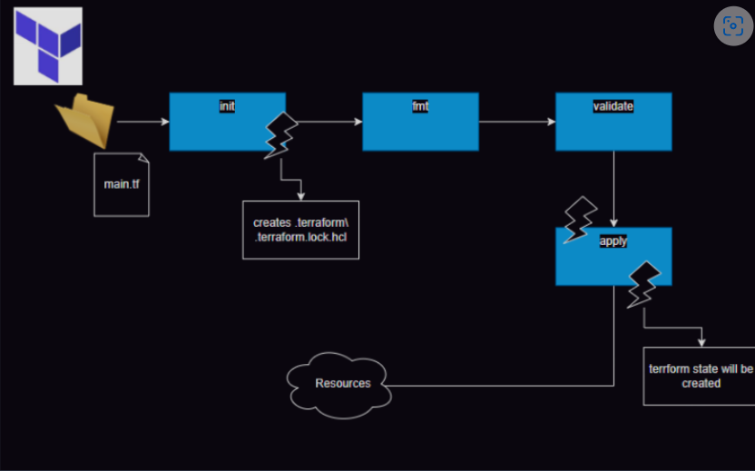
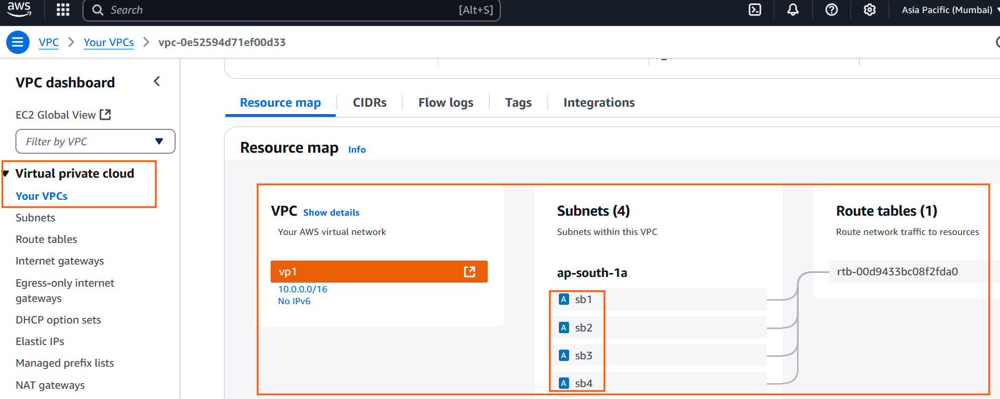
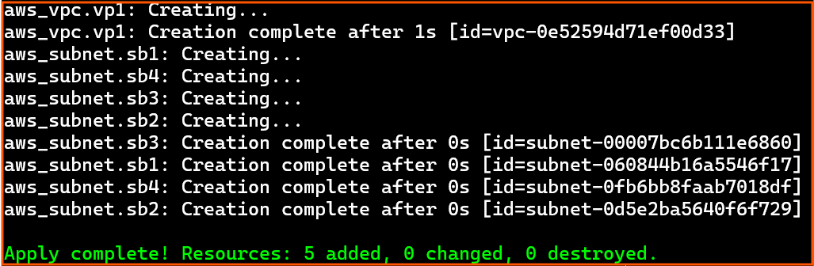
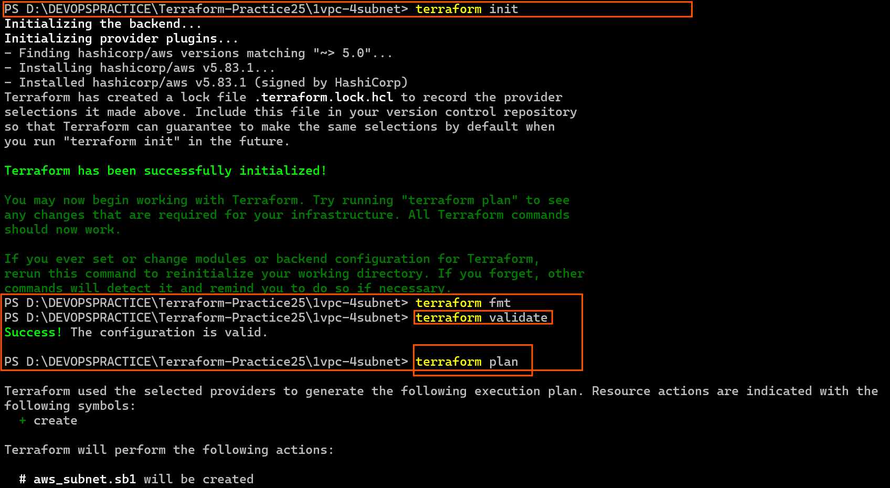
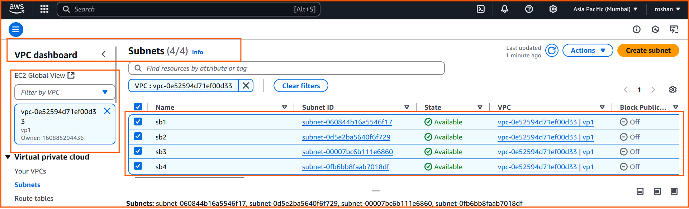
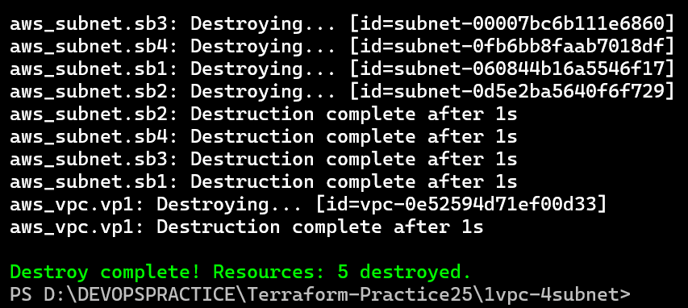

# Terraform state file

* On every apply (success) a state file representing resources created is maintained by default in the terraform.tfstate file



# Accessing attributes

* syntax for resource attributes

```
resource "resource_type" "resource_name" {
  # Configuration settings for the resource
  attribute1 = value1
  attribute2 = value2
  # ...
}
 
 or 

<type>.<id/name>.<attribute>

```

* To play with this we can use  terraform console


* If you use attribute of resource A in resource B, the creation order will be first A then B this is referred as implcit dependency

* Resource creation order can be controlled implicitly or even explicitly by using `depends_on` 
  * refer: https://developer.hashicorp.com/terraform/language/meta-arguments/depends_on

# Activity 1: I want to create a vpc with 4 subnets in AWS (contd)

* Lets try adding 1 vpc and  4 subnets
* Lets start 

```
# providers 

# aws provider 

terraform {
  required_providers {
    aws = {
        source = "hashicorp/aws"
        version = "~> 5.0"
    }
  }
}

# Configure the AWS Provider
provider "aws" {
  region = "ap-south-1"
}


# create aws vpc 

resource "aws_vpc" "vp1" {
    cidr_block = "10.0.0.0/16"
    tags = {
        Name = "vp1"
    }
}


## create 4 aws subnet 

resource "aws_subnet" "sb1" {
    vpc_id = aws_vpc.vp1.id
    cidr_block = "10.0.0.0/24"

    tags = {
        Name = "sb1"
    }
    depends_on = [ aws_vpc.vp1 ]
}

# subnet2 

resource "aws_subnet" "sb2" {
    vpc_id = aws_vpc.vp1.id
    cidr_block = "10.0.1.0/24"
    
    tags = {
        Name = "sb2"
    }
    depends_on = [ aws_vpc.vp1 ]
}


# subnet 3

resource "aws_subnet" "sb3" {
  vpc_id = aws_vpc.vp1.id
  cidr_block = "10.0.2.0/24"

  tags = {
    Name = "sb3"
  }
  depends_on = [ aws_vpc.vp1 ]
}


# subnet 4

resource "aws_subnet" "sb4" {
    vpc_id = aws_vpc.vp1.id
    cidr_block = "10.0.3.0/24"
  
  tags = {
    Name = "sb4"
  }
  depends_on = [ aws_vpc.vp1 ]
}
```

 #aws vpc and subnet 





* Lets understand the work we have done,
* This template creates a vpc with 4 subnets in mumbai region with fixed ip ranges

# Terraform style guide
 * refer: https://developer.hashicorp.com/terraform/language/style

# TFLint
 * This is a linter for terraform which cross checks your terraform templates for
   * best practices
   * stylers
 
 * For aws related templates add a specific plugin for aws checks
 * for aws specific configuration for tflint

* # Versioning constraints
  * refer: https://developer.hashicorp.com/terraform/language/expressions/version-constraints

# Using terraform recommended file structure

 * refer: https://developer.hashicorp.com/terraform/language/modules/develop/structure


-------------------------------------------------------------------------------------