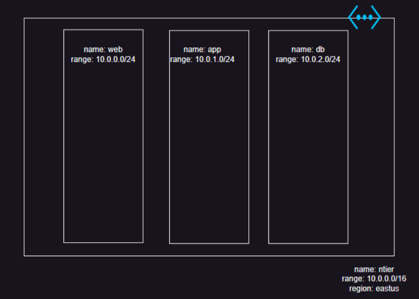

# Variables

* refer: https://developer.hashicorp.com/terraform/language/values/variables
  
* Variables are the inputs that can be passed
* basic syntax for creating a variable

```
variable "<name>" {
    type = <data of terraform>
    default = ""
    description = "purpose of variable"
}
    
``` 
* To use the variable use syntax var.<name>

# Using variables in activity 1

* Variable values can be passed during apply

```
terraform apply -var "<name>=<value>"
terraform apply -var vpc_cidr=10.0.0.0/16
```

* Variables values can be stored in a file with extension .tfvars and passed during apply.

`terraform apply -var-file= 'default.tfvars'`

# Outputs
 
 * refer: https://developer.hashicorp.com/terraform/tutorials/configuration-language/outputs
 * Terraform template outputs show the output after every apply for official docs
* Sample output

* Adding a sample output to activity 1
* outputs.tf file contains outputs

# How to create multiple resources in terraform

* refer: https://registry.terraform.io/providers/OctopusDeployLabs/octopusdeploy/latest/docs/guides/4-create-multiple-resources

* refer: https://developer.hashicorp.com/terraform/tutorials/configuration-language/for-each


# Terraform functions

* refer: https://developer.hashicorp.com/terraform/language/functions


# Activity 2: Create a Network in Azure

* Overview


* Terraform azure providers
    * azurerm (Hashicorp) this is most widely used
    * azapi (Microsoft) few customers use this as well

